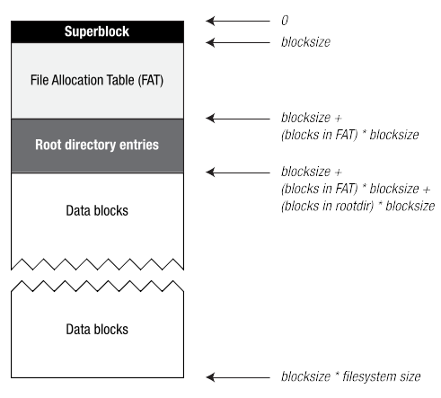

# Assignment 4

## Goal of this assignment

Write four C programs implementing operations on a 360fs file-system image (i.e., sample images will be provide to you). The operations are: (1) printing information about a disk image (stat360fs); (2) printing a directory listing of files in a disk image (ls360fs); (3) outputting the contents of a file in disk image to the host console’s stdout stream (cat360fs); and (4) copying a host-system file to a disk image (stor360fs).

## 360fs

Before describing your four tasks, you first need to know more about the file system for this assignment. It has four major components as shown in the diagram below (with arrows indicating byte offsets from the start of the file system).



The size of the file-system disk image in bytes is the product of its blocksize (always some number of bytes having a power of 2) and the file-system size (always expressed some number of blocks, where this number need not be a power of 2). For example, if the blocksize is 512 bytes and the number of blocks is 5120, then the disk-image size of the file system is 2,621,440 bytes. Note also that a block is a logical concept.

The superblock is the first area and is reserved for critical file-system metadata. The layout of this block is as follows:

|Description|Size|Value in IMAGES/disk02X.img|
|-----------|----|---------------------------|
|file-system identifier| 8 bytes | 360fs|
|blocksize| 2 bytes| 0x0100|
|file-system size (in blocks) | 4 bytes | 0x00000bb8 |
|block where FAT starts | 4 bytes | 0x00000001 |
| # of blocks in FAT | 4 bytes | 0x0000002f |
| block where root directory starts | 4 bytes | 0x00000030 |
|# of blocks in root directory | 4 bytes | 0x00000010 |

Everything from the last superblock entry to the end of the first disk block is otherwise filled with zeros.

The File Allocation Table (FAT) is stored in the second section of the disk image and always starts at the second block. However, before describing the FAT we must first describe the directory entries contained with the root-directory entries section.

Each directory entry is 64 bytes in size, and the maximum number of these entries within the root directory is fixed. (For 360fs this number is 64.) Each file existing in the file system will have its own directory entry. The layout of every directory entry is as follows:

|Description|Size|
|---|---|
|status| 1 byte|
|starting block | 4 bytes|
|# of blocks in file | 4 bytes|
|file size (in bytes)| 4 bytes|
|create time|  7 bytes|
|modify time| 7 bytes|
|filename| 31 bytes|
|unused (set to 0xff| 6 bytes|

- status:  bit mask describing the status of the file. Only three bits are used. Bit 0 (i.e., least significant bit) is false if the entry is available, true otherwise. Bit 1 is set to true if the entry is for a normal file; bit 2 is set to true if the entry is for a directory. Therefore bits 1 and 2 cannot both be set to true (i.e., an entry is either a normal file or it is a directory but not both).
- starting block: The block in the disk image that is the first block of the file corresponding to the directory entry.
- \# of blocks in file: Total number of blocks in the file 
- file size: In bytes. Note that file size must be less than or equal to the # of blocks in file * file-system blocksize.
- create time, modify time: Data and time when the file was created / modified. The storage format for times is described a bit further below.
- filename: a null-terminated string (i.e., the largest file-name length is 30 chars). Characters accepted in filenames are alphabetic (upper- and lower-case), digits (0-9) and the underscore character (i.e., [a-zA-Z0-9_]).

The date/time stored in a directory entry assumes something having the form of YYYYMMDDHHMMSS where:

- two bytes are used to store the year; and
- one byte each is used to store other values (month, day, hour, minute second).

This results in seven bytes for each date/time.

We can now return to the File Allocation Table. The concept of a FAT has been around for nearly forty years and has some similarities to an array-based implementation of a linked list (i.e., FAT itself treated as an array of 4-byte integers). In order to find out what blocks belong to a file:

1. The directory-entry for the file is located and the starting block is read from that entry – let’s use S as the name of the file’s starting block.
2. Block S in the Data Block section of the file system is then read.
3. To find the next block in the file, we look at the value in entry S of the FAT; let’s use T as the name of this latter entry’s value, i.e., T = FAT[S]. If T’s value does not indicate end-of-file, then that value is the next block in the file, and so we set S to T and go back to step 2; otherwise we stop. (Note would not expect T’s value to indicate the block as available or as reserved.)

FAT entries are four bytes long (32 bits). Therefore when the file-system blocksize is 256 bytes, each block in the FAT will contain 64 FAT entries; if the blocksize is 512 bytes, then each block will contain 128 FAT entries, etc. (There are as many FAT entries are there are blocks in the entire file system.)

FAT entries may contain the following values indicating the status of its corresponding file-system block:

|Value|Meaning|
|---|---|
|0x00000000|This file-system block is available (i.e. free-block list and FAT are combined together)|
|0x00000001|This file-system block is reserved (i.e., part of the superblock or the FAT)|
|0x00000002 – 0xffffff00|This file-system block is allocated to some file|
|0xffffffff|This is the last block in a file|

The final section of the disk image is made up of the data blocks for files and for subdirectories, and we would expect this to be the largest section of the disk image.

## Task 1: stat360fs.c

Write a program that displays information about a 360fs file-system image. Amongst other things your code must read in the superblock of the disk image and use that information to read entries in the FAT. Here is the program’s output for IMAGES/disk03X.img in the distributed files (and please use this format):

```
$ ./stat360fs --image IMAGES/disk03X.img 
360fs (disk03X.img)

-------------------------------------------------
  Bsz   Bcnt  FATst FATcnt  DIRst DIRcnt
  256   7900      1    124    125     16

-------------------------------------------------
 Free   Resv  Alloc
 7759    125     16
 ```

## Task 2: ls360fs.c

Write a program that displays the root-directory listing for a 360fs file-system image. Here is an example of the program’s output for IMAGES/disk04.img in the distributed files.

```
$ ./ls360fs --image IMAGES/disk04.img
     159 2022-Jul-14 15:20:26 alphabet_short.txt
    6784 2022-Jul-14 15:20:26 alphabet.txt
      93 2022-Jul-14 15:20:26 digits_short.txt
   18228 2022-Jul-14 15:20:26 digits.txt
```
On each line eight digits are used for the file size (in bytes). Although the order of lines in your output may vary from what is expected, each expected line must appear in the output ­– and no others! Therefore please use the line format as shown. (And how might we indicate the a directory entry is itself a directory??)

## Task 3: cat360fs.c

Write a program that copies a file from a disk image to the stdout stream of the host console. If the specified file is not found in the root directory, print a “file not found” message on a single line and exit the program.

```
$ ./cat360fs --image IMAGES/disk04.img --file alphabet_short.txt
abcdefghijklmnopqrstuvwxyzABCDEFGHIJKLMNOPQRSTUVWXYZ
abcdefghijklmnopqrstuvwxyzABCDEFGHIJKLMNOPQRSTUVWXYZ
abcdefghijklmnopqrstuvwxyzABCDEFGHIJKLMNOPQRSTUVWXYZ
```

## Task 4: stor360fs.c

Write a program that copies a file from host system to a specified disk image. You should print an appropriate message if (a) the host-system file cannot be found, or (b) the file already exists on the disk image, or (c) there is not enough room to store the file on the disk image.

```
$ cat >foo.txt
Foo!
<ctrl-D>
$ ./stor360fs --image disk03.img --file foo.txt --source foo.txt
$ ./ls360fs --image disk03.img
     159 2022-Jul-16 19:58:56 alphabet_short.txt
      93 2022-Jul-16 19:58:56 digits_short.txt
       5 2022-Jul-17 13:20:32 foo.txt
$ ./stor360fs --image disk03.img --file foo.txt --source foo.txt
file already exists in the image
$ ./cat360fs --image disk03.img --file foo.txt | diff ./foo.txt -
$ # no output from diff -- that’s good as it means the files are identical
```

Note the file name of the source file (on the host system) need not be matched by the file name as it is stored in the disk image.

&copy; 2022 David Clark, Mike Zastre
